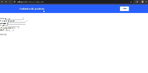

<h1 align="center">Cadastro de Ecommerce</h1>

Um site / repositório de cadastro para mercado, usando html e phpmyadimim para cadastro de informações juntas a banco de dados.

<code>Usando de base um site pré desenvolvido pelo professor Leonardo Rocha, criamos em sala mais três páginas no mesmo modelo para cadastrar produtos,</code> <code>marca e categoria.</code>

# Índice

# 💕 Aplicação na página

## ❤️Descrição

- Com ajuda da Julia Oliveira

### 💖 Linguagems usadas
- ``Css``
- ``Html``
- ``JavaScript``
- ``Github``
- ``Bootstrap``
#### VS CODE
- Version: 1.71.0 (system setup)
- Commit: 784b0177c56c607789f9638da7b6bf3230d47a8c
- Date: 2022-09-01T07:36:10.600Z
- Electron: 19.0.12
- Chromium: 102.0.5005.167
- Node.js: 16.14.2
- V8: 10.2.154.15-electron.0
- OS: Windows_NT x64 10.0.22621
- Sandboxed: No
## 🥰Fontes consultadas

*  - 
* [Github](https://gist.github.com/lohhans/f8da0b147550df3f96914d3797e9fb89) - Um modelo para fazer um bom README.md
* [Boostrap](https://getbootstrap.com/) - Pagina inicial do Boostrap

## 😍Autores
* [Marsh](https://github.com/MarshyyUWU)

