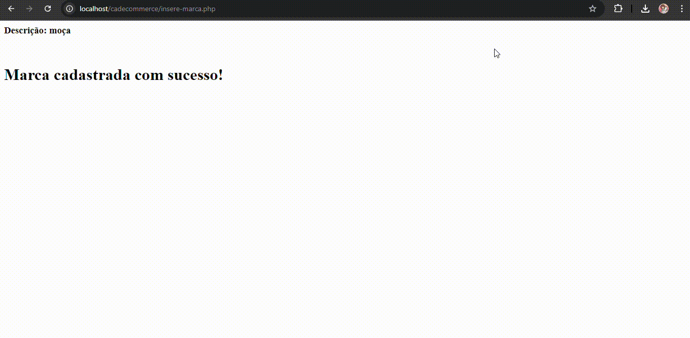

<h1 align="center">🛒 Cadastro de Ecommerce 🛒</h1>
<p align="center">Um site / repositório de cadastro para mercado, usando html e phpmyadimim para cadastro de informações juntas a banco de dados.</p>
<p align="center"><code>Usando de base um site pré desenvolvido pelo professor Leonardo Rocha, criamos em sala mais três páginas no mesmo modelo para cadastrar produtos,</code>

# Índice


# 💕 Aplicação na página


⬆️ Cadastro e compra de pedido ⬆️



⬆️ Cadastro de marca para produto ⬆️

## ❤️Descrição

# comandos utílizados

### Produtos
``` php
<?php
include_once('controller/conexao.php');
 
$categoria      = $_POST['seleciona_categoria'];
$marca          = $_POST['seleciona_marca'];
$nome_produto   = $_POST['nome'];
$descricao      = $_POST['descricao'];
$estoque        = $_POST['estoque'];
$preco          = $_POST['preco'];
 
$grava_produto = "INSERT INTO produtos(`IDCATEGORIA`, `IDMARCA`, `NOME`,
`DESCRICAO`, `ESTOQUE`, `PRECO`) VALUES
('$categoria','$marca','$nome_produto','$descricao','$estoque','$preco')";
 
$result_gravacao = mysqli_query($mysqli, $grava_produto);
 
    if(mysqli_affected_rows($mysqli) != 0){
        echo "
        <META HTTP-EQUIV=REFRESH CONTENT = 'O;URL=produtos.php'>
        <script type=\"text/javascript\">
        alert('Produto cadastrado com sucesso');
        </script>";
 
        }else{
        echo "
        <META HTTP-EQUIV=REFRESH CONTENT = 'O;URL=produtos.php'>
        <script type=\"text/javascript\">
        alert('Produto não cadastrado');
        </script>";
}
?>
```
 
### Categoria
```php
<?php
include('controller/conexao.php');
 
$descricao = $_POST['descricao'];
 
echo "<h3>Descrição: $descricao </h3></br>";
 
$cad_categoria = "INSERT INTO categoria(DESCRICAO) VALUES ('$descricao')";
 
if(mysqli_query($mysqli, $cad_categoria)){
    echo "<h1>Categoria cadastrada com sucesso!</h1></br>";
} else {
    echo "Erro: " . $cad_categoria . "</br>" . mysqli_error($mysqli);
}
 
mysqli_close($mysqli);
 
?>
```
 
### Marca
```php
<?php
include('controller/conexao.php');
 
$descricao = $_POST['descricao'];
 
echo "<h3>Descrição: $descricao </h3></br>";
 
$cad_marca = "INSERT INTO marca(DESCRICAO) VALUES ('$descricao')";
 
if(mysqli_query($mysqli, $cad_marca)){
    echo "<h1>Marca cadastrada com sucesso!</h1></br>";
} else {
    echo "Erro: " . $cad_marca . "</br>" . mysqli_error($mysqli);
}
 
mysqli_close($mysqli);
 
?>
```

- Com ajuda da Julia Oliveira


### 💖 Linguagems usadas
- ``Css``
- ``Html``
- ``JavaScript``
- ``Github``
- ``Bootstrap``
#### VS CODE
- Version: 1.71.0 (system setup)
- Commit: 784b0177c56c607789f9638da7b6bf3230d47a8c
- Date: 2022-09-01T07:36:10.600Z
- Electron: 19.0.12
- Chromium: 102.0.5005.167
- Node.js: 16.14.2
- V8: 10.2.154.15-electron.0
- OS: Windows_NT x64 10.0.22621
- Sandboxed: No
## 🥰Fontes consultadas

* []() - 
* [Github](https://gist.github.com/lohhans/f8da0b147550df3f96914d3797e9fb89) - Um modelo para fazer um bom README.md
* [Boostrap](https://getbootstrap.com/) - Pagina inicial do Boostrap

## 😍Autores
* [Marsh](https://github.com/MarshyyUWU)

